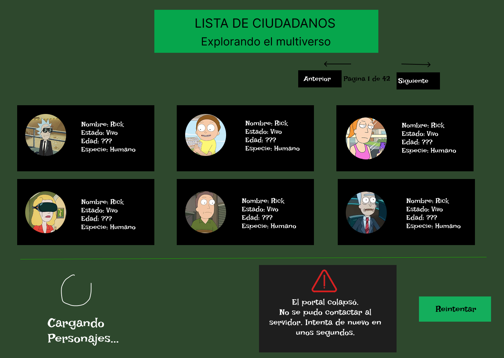

# Citizen Directory — Rick and Morty Character Browser

A small React frontend built for the "Frontend que consume una API" assignment (Corte 1, Semana 4).



## Overview

Citizen Directory is a single-page React application that browses fictional characters from the Rick and Morty universe. The app consumes the public [Rick and Morty API](https://rickandmortyapi.com/api/character) using the native `fetch` function, requesting one page of twenty characters at a time and letting the user navigate between pages. It explicitly handles three states: a loading state with an animated spinner while the request is in flight, a success state that renders the character data as a responsive grid of cards, and an error state with a descriptive message and a retry button if the request fails. The codebase is organized into a dedicated API layer (`src/api`), a custom hook that owns the loading/success/error logic (`src/hooks`), and small presentational components (`src/components`), so each piece has a single responsibility. Visually, the interface takes its color palette and iconography (the green "portal" accent, the circular character frames) directly from the show's own visual language, so the design choices are grounded in the subject matter rather than generic defaults.

## Vista previa / Mockup

El wireframe de la distribución de la vista está en [`docs/mockup.png`](./docs/Mockup.png). Muestra los tres estados que maneja la app (carga, datos, error) y cómo se distribuyen el encabezado, la grilla de tarjetas y el pie de página.

## Estructura del proyecto

```
src/
  api/
    rickAndMortyApi.js   # toda la lógica de fetch, aislada de la UI
  hooks/
    useCharacters.js     # maneja los estados loading / success / error
  components/
    Header.jsx           # título + paginación
    CharacterList.jsx    # grilla (estado "success")
    CharacterCard.jsx    # tarjeta individual de personaje
    LoadingState.jsx     # estado "loading"
    ErrorState.jsx       # estado "error" con botón de reintentar
  App.jsx                # orquesta qué estado renderizar
  App.css / index.css    # estilos y tokens de diseño
docs/
  mockup.svg              # wireframe de la vista
```

## Cómo ejecutarlo

Requisitos: [Node.js](https://nodejs.org/) 18 o superior.

```bash
# 1. Instalar dependencias
npm install

# 2. Levantar el servidor de desarrollo
npm run dev

# 3. Abrir el navegador en la URL que muestra la terminal
#    (por defecto http://localhost:5173)
```

Para generar la versión de producción:

```bash
npm run build
npm run preview
```

## API utilizada

- **Rick and Morty API** — https://rickandmortyapi.com/api/character
- Pública, gratuita, no requiere API key.
- Endpoint usado: `GET /character?page={n}` (20 personajes por página).

## Tecnologías

- React 19 + Vite
- CSS puro (sin librerías de UI), con variables CSS como sistema de tokens de diseño
- Fetch API nativa del navegador (sin librerías HTTP externas)
