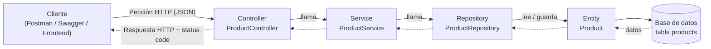

# Semana 6: Arquitectura en capas de una API

**Caso:** Inven-Track, API REST para controlar el inventario de una salsamentaria. Recurso de ejemplo: `Product` (producto).

## 1. Diagrama de capas



Flujo: `controller → service → repository → entity`. Las flechas punteadas muestran el camino de regreso con la respuesta.

## 2. Responsabilidad de cada capa

| Capa | Clase en Inven-Track | Responsabilidad |
|---|---|---|
| **Controller** | `ProductController` | Recibe la petición HTTP, valida el formato de los datos (`@Valid`), llama al service y devuelve la respuesta con su código de estado (200, 201, 204). No contiene lógica de negocio ni accede a la base de datos. |
| **Service** | `ProductService` | Contiene la lógica de negocio. Por ejemplo, decide que un producto que no existe produce un error 404 y copia los datos recibidos al producto que se va a guardar. Coordina al repository. |
| **Repository** | `ProductRepository` | Solo accede a los datos. Extiende `JpaRepository`, por lo que ofrece `findAll`, `findById`, `save` y `delete` sin escribir SQL. No toma decisiones de negocio. |
| **Entity** | `Product` | Representa la tabla `products` de la base de datos (cada objeto es una fila). Define los campos (`id`, `name`, `description`, `price`, `stock`) y sus validaciones. |

## 3. Endpoint de ejemplo

**`POST /api/products`**: registrar un producto nuevo.

Cuerpo de la petición:

```json
{ "name": "Queso campesino", "description": "Bloque 500g", "price": 12500, "stock": 40 }
```

Por qué capas pasa:

1. **Controller:** `ProductController.create()` recibe el JSON, lo convierte en un objeto `Product` (`@RequestBody`) y valida los campos (`@Valid`). Si son inválidos, responde **400** sin llegar al service.
2. **Service:** `ProductService.create()` copia los datos a un `Product` nuevo y pide guardarlo.
3. **Repository:** `ProductRepository.save()` ejecuta el `INSERT` en la base de datos.
4. **Entity:** `Product` es el objeto que se guarda como una fila de la tabla `products`; la base de datos le asigna el `id`.
5. **Respuesta:** el producto guardado regresa por las mismas capas hasta el controller, que responde **201 Created** con el producto en JSON.
